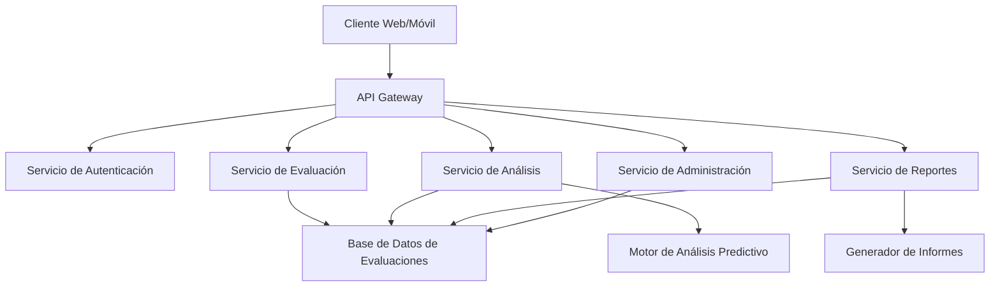
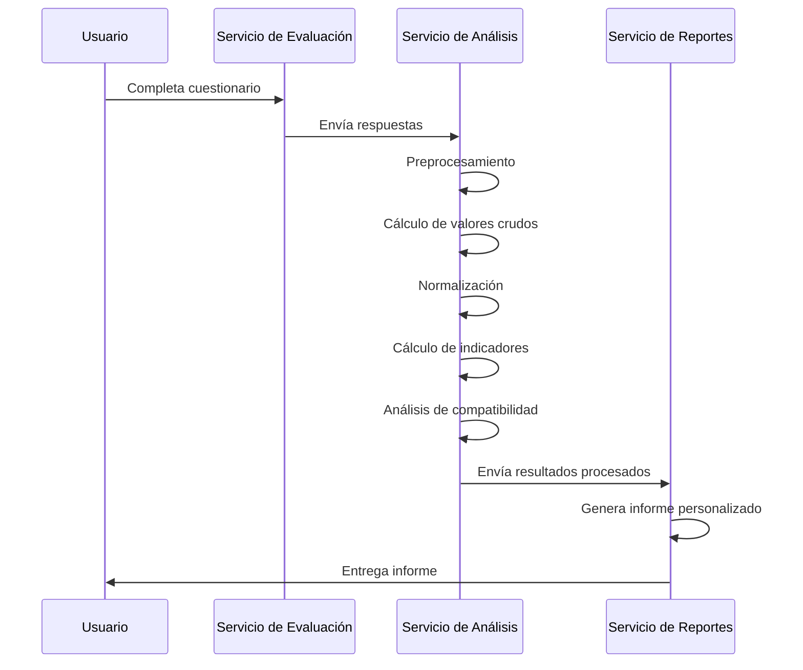

# Plan de Implementación Técnica: Plataforma de Evaluación Conductual

## Resumen Ejecutivo

Este documento presenta el plan de implementación técnica para el desarrollo de una plataforma de evaluación conductual basada en los principios y modelos descritos en la documentación previa. El plan detalla la arquitectura del sistema, las tecnologías recomendadas, los componentes principales, y un cronograma de desarrollo faseado para garantizar una implementación exitosa.

## 1. Arquitectura del Sistema

### 1.1 Visión General de la Arquitectura

La plataforma se desarrollará siguiendo una arquitectura de microservicios, lo que permitirá una mayor escalabilidad, mantenibilidad y flexibilidad. Esta arquitectura facilitará el desarrollo independiente de los diferentes componentes del sistema y su integración coherente.

### 1.2 Componentes Principales

#### 1.2.1 Frontend

- **Aplicación Web**: Interfaz principal para usuarios, evaluados y administradores.
- **Aplicación Móvil**: Versión optimizada para dispositivos móviles.
- **Panel de Administración**: Interfaz para la gestión de usuarios, evaluaciones y configuración del sistema.

#### 1.2.2 Backend

- **API Gateway**: Punto de entrada único para todas las solicitudes de clientes.
- **Servicio de Autenticación**: Gestión de usuarios, roles y permisos.
- **Servicio de Evaluación**: Administración de cuestionarios, pruebas y recopilación de datos.
- **Servicio de Análisis**: Procesamiento de datos y aplicación de algoritmos de evaluación.
- **Servicio de Reportes**: Generación y entrega de informes personalizados.
- **Servicio de Administración**: Configuración del sistema y gestión de recursos.

#### 1.2.3 Bases de Datos

- **Base de Datos Relacional**: Para datos estructurados (usuarios, configuraciones, etc.).
- **Base de Datos NoSQL**: Para datos semi-estructurados (respuestas a evaluaciones, resultados de análisis).
- **Data Warehouse**: Para análisis históricos y generación de informes agregados.

#### 1.2.4 Servicios Auxiliares

- **Sistema de Colas**: Para procesamiento asíncrono de tareas intensivas.
- **Servicio de Caché**: Para optimizar el rendimiento de consultas frecuentes.
- **Sistema de Logging**: Para registro y monitoreo de actividades del sistema.
- **Servicio de Notificaciones**: Para envío de alertas y comunicaciones a usuarios.

## 2. Tecnologías Recomendadas

### 2.1 Frontend

- **Framework Principal**: React.js con TypeScript
- **Gestión de Estado**: Redux o Context API
- **Componentes UI**: Material-UI o Ant Design
- **Visualización de Datos**: D3.js para gráficos personalizados
- **Aplicación Móvil**: React Native

### 2.2 Backend

- **Lenguaje Principal**: Python para servicios de análisis y algoritmos
- **Framework API**: Django REST Framework o FastAPI
- **Servicios Complementarios**: Node.js con Express
- **Comunicación entre Servicios**: gRPC o REST

### 2.3 Bases de Datos

- **Base de Datos Relacional**: PostgreSQL
- **Base de Datos NoSQL**: MongoDB
- **Caché**: Redis
- **Data Warehouse**: Amazon Redshift o Google BigQuery

### 2.4 Infraestructura

- **Contenedorización**: Docker
- **Orquestación**: Kubernetes
- **CI/CD**: Jenkins o GitHub Actions
- **Monitoreo**: Prometheus y Grafana
- **Logging**: ELK Stack (Elasticsearch, Logstash, Kibana)

### 2.5 Inteligencia Artificial y Análisis

- **Bibliotecas de ML**: Scikit-learn, TensorFlow, PyTorch
- **Procesamiento de Datos**: Pandas, NumPy
- **Análisis Estadístico**: SciPy, StatsModels
- **NLP**: NLTK, spaCy (para análisis de texto en respuestas abiertas)

## 3. Implementación del Algoritmo de Evaluación

### 3.1 Componentes del Algoritmo

El algoritmo de evaluación conductual se implementará como un servicio independiente con los siguientes componentes:

1. **Módulo de Preprocesamiento**: Normalización y validación de datos de entrada.
2. **Módulo de Cálculo de Valores Crudos**: Procesamiento inicial de respuestas.
3. **Módulo de Normalización**: Transformación a valores-C según el modelo.
4. **Módulo de Cálculo de Indicadores**: Generación de métricas derivadas.
5. **Módulo de Análisis de Compatibilidad**: Correlación entre perfiles y puestos.
6. **Módulo de Generación de Recomendaciones**: Sugerencias basadas en resultados.

### 3.2 Flujo de Procesamiento

### 3.3 Consideraciones de Implementación

- **Validación Cruzada**: Implementación de mecanismos para validar la precisión del algoritmo.
- **Versionado de Algoritmos**: Sistema para mantener múltiples versiones del algoritmo.
- **Calibración Continua**: Mecanismos para ajustar parámetros basados en retroalimentación.
- **Explicabilidad**: Componentes para proporcionar explicaciones sobre los resultados generados.

## 4. Plan de Desarrollo

### 4.1 Fases de Implementación

#### Fase 1: Fundamentos (Meses 1-3)

- Desarrollo de la arquitectura base
- Implementación de servicios core (autenticación, evaluación básica)
- Desarrollo del frontend básico
- Configuración de infraestructura y CI/CD

#### Fase 2: Algoritmo Core (Meses 4-6)

- Implementación del algoritmo de evaluación conductual
- Desarrollo de módulos de normalización y cálculo de indicadores
- Integración con el servicio de evaluación
- Pruebas de validación del algoritmo

#### Fase 3: Análisis Avanzado (Meses 7-9)

- Implementación de análisis de compatibilidad
- Desarrollo de módulos de recomendación
- Integración de capacidades de IA para análisis predictivo
- Optimización de rendimiento

#### Fase 4: Reportes y Visualización (Meses 10-12)

- Desarrollo del sistema de generación de informes
- Implementación de visualizaciones avanzadas
- Personalización de reportes según perfiles de usuario
- Integración completa de todos los componentes

#### Fase 5: Refinamiento y Lanzamiento (Meses 13-15)

- Pruebas de usuario y ajustes finales
- Optimización de rendimiento y escalabilidad
- Documentación completa
- Despliegue a producción

### 4.2 Hitos Clave

| Hito | Descripción | Fecha Estimada |
|------|-------------|----------------|
| H1 | Arquitectura base implementada | Mes 3 |
| H2 | Algoritmo core funcional | Mes 6 |
| H3 | Sistema de análisis avanzado completado | Mes 9 |
| H4 | Sistema de reportes implementado | Mes 12 |
| H5 | Plataforma lista para lanzamiento | Mes 15 |

### 4.3 Equipo Recomendado

- 2 Desarrolladores Frontend (React, D3.js)
- 3 Desarrolladores Backend (Python, Django/FastAPI)
- 1 Especialista en DevOps
- 1 Científico de Datos / ML Engineer
- 1 Diseñador UX/UI
- 1 QA Engineer
- 1 Product Manager
- 1 Psicólogo Industrial (consultor)

## 5. Consideraciones de Seguridad y Cumplimiento

### 5.1 Seguridad de Datos

- **Encriptación**: Datos en tránsito (TLS) y en reposo (AES-256)
- **Anonimización**: Técnicas para proteger información personal sensible
- **Control de Acceso**: RBAC (Role-Based Access Control) granular
- **Auditoría**: Registro detallado de todas las operaciones sensibles

### 5.2 Cumplimiento Normativo

- **GDPR**: Mecanismos para cumplir con requisitos de privacidad europeos
- **LGPD**: Adaptación para cumplimiento con ley brasileña
- **Regulaciones Sectoriales**: Consideraciones específicas para sectores como salud o finanzas
- **Ética en IA**: Implementación de prácticas para garantizar equidad y transparencia

### 5.3 Disponibilidad y Recuperación

- **Alta Disponibilidad**: Arquitectura redundante para servicios críticos
- **Backup**: Estrategia de respaldo automático con múltiples niveles
- **Recuperación ante Desastres**: Plan documentado con RTO y RPO definidos
- **Monitoreo Proactivo**: Alertas tempranas para potenciales problemas

### 5.4 Protección de Propiedad Intelectual

Para proteger el algoritmo pentadimensional y evitar copias no autorizadas a través de técnicas como web scraping, se implementarán las siguientes estrategias:

#### 5.4.1 Arquitectura Servidor-Cliente Segura
- **Lógica crítica en backend**: Las partes más valiosas del algoritmo (normalización, cálculo de indicadores, análisis de compatibilidad) se ejecutarán exclusivamente en el servidor
- **Transmisión mínima**: El cliente enviará solo datos de entrada y recibirá resultados procesados
- **Servicio Serverless**: Implementación del algoritmo como funciones serverless en Supabase o AWS Lambda

#### 5.4.2 Técnicas de Ofuscación y Protección
- **Ofuscación de código**: Aplicación de técnicas avanzadas de ofuscación para el código que deba ejecutarse en cliente
- **WebAssembly**: Compilación de componentes críticos a WASM para dificultar la ingeniería inversa
- **Huella digital**: Inclusión de variaciones únicas en los resultados para identificar posibles filtraciones

#### 5.4.3 Protección Legal y por Diseño
- **API Key Authentication**: Sistema de autenticación basado en API keys con limitaciones de uso
- **Términos de Servicio**: Marco legal que prohíba explícitamente la ingeniería inversa
- **Tokenización**: Almacenamiento cifrado de parámetros críticos del algoritmo
- **Monitoreo de uso**: Sistemas para detectar patrones sospechosos que indiquen intentos de copiar el algoritmo

#### 5.4.4 Estrategia de Implementación
- **Fase 1**: Implementación básica con ofuscación y división cliente-servidor
- **Fase 2**: Integración de verificación de integridad y tokens de sesión
- **Fase 3**: Implementación de mecanismos avanzados de detección e identificación de uso no autorizado

## 6. Escalabilidad y Mantenimiento

### 6.1 Estrategia de Escalabilidad

- **Escalado Horizontal**: Capacidad para añadir instancias según demanda
- **Particionamiento de Datos**: Estrategia para manejar grandes volúmenes de información
- **Optimización de Consultas**: Índices y estrategias para mantener rendimiento
- **Caché Distribuida**: Implementación para reducir carga en bases de datos

### 6.2 Mantenimiento Continuo

- **Monitoreo de Rendimiento**: Métricas clave para identificar cuellos de botella
- **Actualización de Algoritmos**: Proceso para incorporar mejoras al modelo
- **Gestión de Dependencias**: Estrategia para mantener bibliotecas actualizadas
- **Documentación Técnica**: Mantenimiento de documentación actualizada

## 7. Integración con Sistemas Externos

### 7.1 APIs Públicas

- **API RESTful**: Para integración con sistemas de RRHH
- **Webhooks**: Para notificaciones en tiempo real
- **SSO**: Integración con proveedores de identidad corporativos

### 7.2 Importación/Exportación de Datos

- **Formatos Estándar**: Soporte para CSV, JSON, XML
- **Conectores Específicos**: Para sistemas populares de RRHH (SAP, Workday, etc.)
- **ETL**: Procesos para transformación y carga de datos históricos

## 8. Métricas de Éxito

### 8.1 Métricas Técnicas

- **Tiempo de Respuesta**: < 500ms para operaciones estándar
- **Disponibilidad**: 99.9% (downtime máximo de 8.76 horas/año)
- **Precisión del Algoritmo**: > 85% de correlación con evaluaciones de expertos
- **Escalabilidad**: Capacidad para manejar 10,000 evaluaciones simultáneas

### 8.2 Métricas de Negocio

- **Adopción**: Número de empresas y usuarios activos
- **Retención**: Tasa de renovación de suscripciones
- **Satisfacción**: NPS (Net Promoter Score) > 50
- **ROI para Clientes**: Mejora demostrable en procesos de RRHH

## 9. Riesgos y Mitigaciones

| Riesgo | Impacto | Probabilidad | Estrategia de Mitigación |
|--------|---------|--------------|--------------------------|
| Complejidad del algoritmo | Alto | Media | Desarrollo iterativo con validación continua |
| Escalabilidad insuficiente | Alto | Baja | Pruebas de carga tempranas y diseño para escala |
| Sesgos en el algoritmo | Alto | Media | Validación con diversos conjuntos de datos y revisión por expertos |
| Problemas de integración | Medio | Alta | APIs bien documentadas y período de beta con partners |
| Cambios regulatorios | Medio | Media | Monitoreo legal y diseño modular para adaptación |

## 10. Conclusiones y Recomendaciones

La implementación de esta plataforma de evaluación conductual representa un proyecto ambicioso pero factible, con un alto potencial de impacto en el ámbito de recursos humanos. Para maximizar las probabilidades de éxito, se recomienda:

1. **Enfoque Iterativo**: Priorizar el desarrollo de un MVP funcional y expandir gradualmente.
2. **Validación Temprana**: Involucrar a usuarios reales desde las primeras etapas.
3. **Flexibilidad**: Mantener la arquitectura adaptable a nuevos requerimientos.
4. **Colaboración Multidisciplinaria**: Asegurar la participación activa de expertos en psicometría.
5. **Inversión en Calidad**: Priorizar pruebas automatizadas y revisiones de código.

Con una ejecución cuidadosa de este plan, la plataforma tiene el potencial de transformar significativamente los procesos de evaluación conductual en entornos organizacionales.

---

## Anexos

### Anexo A: Diagrama Detallado de Arquitectura

[Incluir diagrama detallado]

### Anexo B: Especificaciones de API

[Incluir documentación preliminar de API]

### Anexo C: Modelo de Datos

[Incluir esquema de base de datos]
