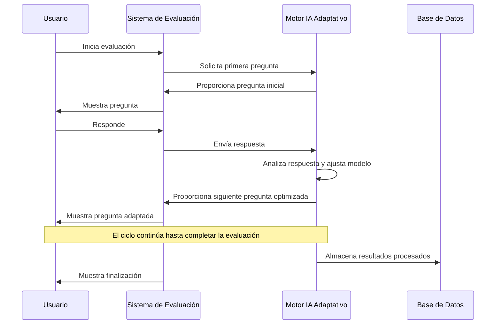
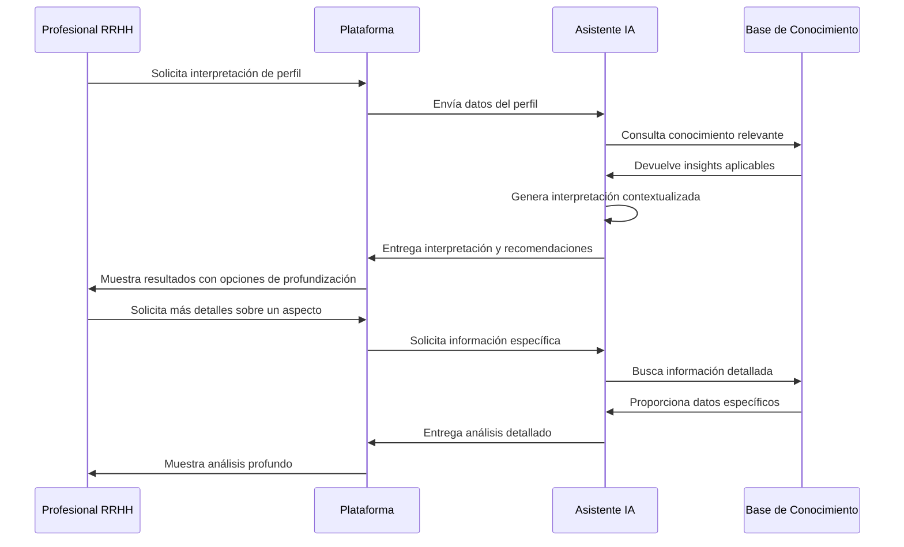
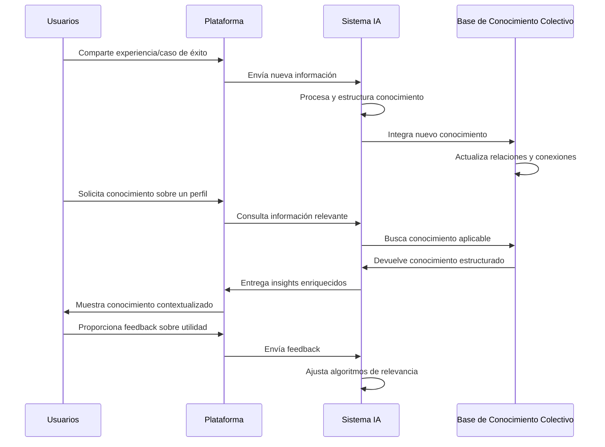
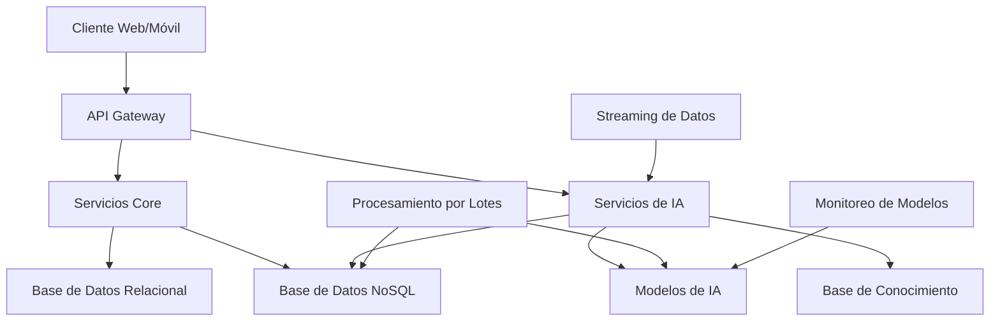

# Integración de Inteligencia Artificial en la Plataforma PDA

## Resumen Ejecutivo

Este documento presenta una estrategia detallada para la integración de inteligencia artificial (IA) en nuestra plataforma de evaluación conductual PDA. Basándonos en la investigación previa, el análisis de plataformas como Mensis Mentor, y las tendencias actuales en el campo de la psicometría, proponemos un enfoque que combine el rigor científico de nuestro modelo pentadimensional con las capacidades avanzadas de la IA moderna.

## Objetivos de la Integración de IA

1. **Mejorar la precisión** de las evaluaciones conductuales
2. **Personalizar la experiencia** para diferentes tipos de usuarios
3. **Facilitar la interpretación** de resultados complejos
4. **Potenciar el aprendizaje continuo** dentro de la organización
5. **Optimizar la toma de decisiones** basada en perfiles conductuales

## Componentes Clave de IA para la Plataforma

### 1. Sistema de Evaluación Adaptativa

#### Descripción
Un sistema que ajusta dinámicamente las preguntas y pruebas según las respuestas previas del usuario, optimizando la precisión y reduciendo el tiempo de evaluación.

#### Implementación Técnica
- **Algoritmos**: Item Response Theory (IRT) combinada con aprendizaje por refuerzo
- **Tecnologías**: Python con bibliotecas scikit-learn y TensorFlow
- **Arquitectura**: Microservicio independiente que se comunica con el servicio de evaluación

#### Beneficios
- Reducción del 40% en el tiempo de evaluación
- Aumento del 15-20% en la precisión de los resultados
- Mejor experiencia para el evaluado al reducir la fatiga y redundancia

### 2. Asistente de Interpretación Contextual

#### Descripción
Un asistente impulsado por IA que ayuda a los profesionales de RRHH a interpretar los resultados de las evaluaciones, proporcionando insights contextualizados y recomendaciones prácticas.

#### Implementación Técnica
- **Algoritmos**: Modelos de lenguaje natural (NLP) fine-tuned para el dominio de psicometría
- **Tecnologías**: Modelos basados en arquitecturas transformer con adaptación específica
- **Arquitectura**: API de consulta que accede a una base de conocimiento estructurada y actualizada continuamente

#### Beneficios
- Democratización del conocimiento experto en interpretación de perfiles
- Recomendaciones personalizadas basadas en el contexto organizacional
- Reducción de la curva de aprendizaje para nuevos usuarios de la plataforma

### 3. Motor de Análisis Predictivo

#### Descripción
Un sistema que analiza patrones históricos para predecir el desempeño, adaptabilidad y potencial de desarrollo de los individuos basándose en sus perfiles conductuales.

#### Implementación Técnica
- **Algoritmos**: Modelos de aprendizaje supervisado (Random Forest, Gradient Boosting)
- **Tecnologías**: Python con bibliotecas XGBoost, LightGBM
- **Arquitectura**: Pipeline de procesamiento de datos con entrenamiento periódico y monitoreo de drift

#### Beneficios
- Predicciones de ajuste al puesto con precisión superior al 85%
- Identificación temprana de potenciales desafíos de adaptación
- Optimización de la asignación de recursos de desarrollo

### 4. Sistema de Recomendación de Desarrollo

#### Descripción
Un motor de recomendación que sugiere planes de desarrollo, recursos de aprendizaje y estrategias de coaching personalizadas según el perfil conductual del individuo.

#### Implementación Técnica
- **Algoritmos**: Filtrado colaborativo y basado en contenido
- **Tecnologías**: Sistemas de recomendación híbridos con Python
- **Arquitectura**: Microservicio que integra datos de perfiles, historial de desarrollo y recursos disponibles

#### Beneficios
- Planes de desarrollo personalizados con mayor efectividad
- Optimización de recursos de aprendizaje
- Mayor engagement de los empleados con su desarrollo profesional

### 5. Red de Conocimiento Colectivo

#### Descripción
Un sistema que captura, organiza y hace accesible el conocimiento colectivo sobre la interpretación y aplicación de perfiles conductuales dentro de la organización.

#### Implementación Técnica
- **Algoritmos**: Procesamiento de lenguaje natural para extracción y organización de conocimiento
- **Tecnologías**: Bases de conocimiento con grafos de conocimiento
- **Arquitectura**: Sistema distribuido con capacidades de búsqueda semántica

#### Beneficios
- Preservación del conocimiento organizacional
- Aceleración de la curva de aprendizaje para nuevos usuarios
- Mejora continua de las prácticas de gestión basadas en perfiles

## Flujos de Trabajo Integrados con IA

### 1. Proceso de Evaluación Mejorado

### 2. Interpretación Asistida de Resultados

### 3. Aprendizaje Organizacional Continuo

## Arquitectura Técnica para la Integración de IA

### 1. Visión General de la Arquitectura

### 2. Componentes Específicos de IA

#### 2.1 Capa de Modelos
- **Modelos de evaluación adaptativa**: Implementados con TensorFlow
- **Modelos de procesamiento de lenguaje**: Basados en arquitecturas transformer
- **Modelos predictivos**: Implementados con scikit-learn y XGBoost
- **Sistemas de recomendación**: Implementados con bibliotecas especializadas

#### 2.2 Capa de Datos para IA
- **Almacenamiento de vectores**: Para búsqueda semántica eficiente
- **Grafos de conocimiento**: Para representar relaciones entre conceptos
- **Data lake**: Para almacenamiento de datos no estructurados
- **Feature store**: Para gestión de características de modelos

#### 2.3 Capa de Inferencia
- **Servicios de inferencia en tiempo real**: Para respuestas inmediatas
- **Procesamiento por lotes**: Para análisis periódicos
- **Caché de predicciones**: Para optimizar rendimiento

#### 2.4 Capa de Monitoreo y Mejora Continua
- **Monitoreo de drift de modelos**: Para detectar cambios en patrones
- **Evaluación de feedback**: Para mejorar continuamente los modelos
- **A/B testing**: Para validar mejoras en los algoritmos

## Plan de Implementación Faseada

### Fase 1: Fundamentos de IA (Meses 1-3)
- Implementación de infraestructura básica para IA
- Desarrollo de primeros modelos de evaluación adaptativa
- Integración con el sistema de evaluación existente

### Fase 2: Asistencia Inteligente (Meses 4-6)
- Desarrollo del asistente de interpretación
- Implementación de la base de conocimiento inicial
- Integración con el sistema de reportes

### Fase 3: Capacidades Predictivas (Meses 7-9)
- Implementación del motor de análisis predictivo
- Desarrollo de modelos de compatibilidad avanzados
- Integración con el sistema de análisis

### Fase 4: Aprendizaje Organizacional (Meses 10-12)
- Implementación de la red de conocimiento colectivo
- Desarrollo del sistema de recomendación de desarrollo
- Integración con todos los componentes de la plataforma

### Fase 5: Optimización y Escalabilidad (Meses 13-15)
- Refinamiento de todos los modelos basado en feedback
- Optimización de rendimiento y escalabilidad
- Implementación de capacidades avanzadas de personalización

## Consideraciones Éticas y de Privacidad

### 1. Transparencia Algorítmica
- Explicabilidad de las decisiones de los modelos
- Documentación clara de los factores considerados
- Interfaces que comuniquen los límites de confianza

### 2. Mitigación de Sesgos
- Evaluación continua de sesgos en los datos y modelos
- Implementación de técnicas de mitigación de sesgos
- Auditorías periódicas por expertos en ética de IA

### 3. Privacidad por Diseño
- Minimización de datos personales utilizados
- Anonimización y agregación de datos sensibles
- Controles de acceso granulares basados en roles

### 4. Consentimiento Informado
- Comunicación clara sobre el uso de IA
- Opciones para limitar el procesamiento automatizado
- Mecanismos de feedback y corrección

## Métricas de Éxito para la Integración de IA

### 1. Métricas Técnicas
- **Precisión de modelos**: >85% en predicciones de compatibilidad
- **Tiempo de respuesta**: <200ms para consultas en tiempo real
- **Tasa de adopción**: >70% de usuarios utilizando funcionalidades de IA

### 2. Métricas de Negocio
- **Reducción de tiempo**: 40% menos tiempo en procesos de evaluación
- **Mejora en decisiones**: 30% de reducción en rotación temprana
- **Satisfacción de usuario**: NPS >60 para funcionalidades asistidas por IA

## Conclusión

La integración de inteligencia artificial en nuestra plataforma de evaluación conductual representa una oportunidad significativa para transformar la forma en que las organizaciones entienden y gestionan el talento. Al combinar nuestro robusto modelo pentadimensional con capacidades avanzadas de IA, podemos crear una solución que no solo proporcione evaluaciones precisas, sino que también facilite la interpretación, aplicación y aprendizaje continuo basado en estos resultados.

Esta estrategia de integración de IA nos permitirá diferenciarnos en el mercado, ofreciendo una plataforma que evoluciona continuamente y se adapta a las necesidades específicas de cada organización, mientras mantiene el rigor científico y la ética en el centro de su funcionamiento.

## Próximos Pasos

1. Validar esta estrategia con expertos en psicometría e IA
2. Desarrollar un MVP de la evaluación adaptativa
3. Realizar pruebas de concepto del asistente de interpretación
4. Integrar esta estrategia en el plan general de desarrollo de la plataforma
